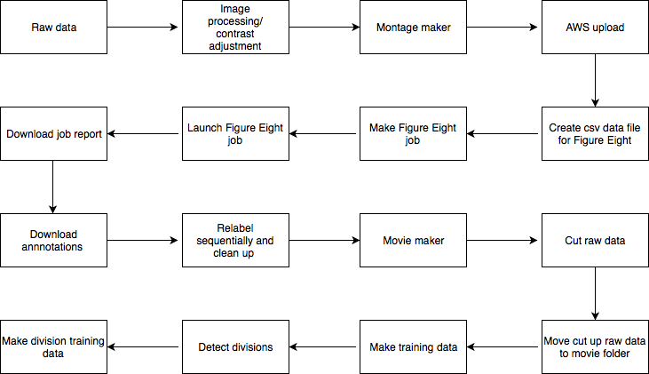

# Caliban Toolbox: Data Engineering Tools for Single Cell Analysis

[](https://travis-ci.com/vanvalenlab/caliban-toolbox)
[](https://coveralls.io/github/vanvalenlab/caliban-toolbox?branch=master)

DeepCell Toolbox is a collection of data engineering tools for processing, annotating, and packaging optical microscopy images. The framework enables crowdsourced annotations and creates training data for [DeepCell](https://github.com/vanvalenlab/deepcell-tf).

The process is as follows:


Read the documentation at

## Getting Started

DeepCell Data Engineering uses `nvidia-docker` and `tensorflow` to enable GPU processing.  

### Build a local docker container

```bash
git clone https://github.com/vanvalenlab/caliban-toolbox.git
cd caliban-toolbox
docker build -t $USER/caliban_toolbox .

```

The tensorflow version can be overridden with the build-arg `TF_VERSION`.

```bash
docker build --build-arg TF_VERSION=1.9.0-gpu -t $USER/caliban_toolbox .
```

### Run the new docker image

```bash
# NV_GPU refers to the specific GPU to run DeepCell Toolbox on, and is not required

# Mounting the codebase, scripts and data to the container is also optional
# but can be handy for local development

NV_GPU='0' nvidia-docker run -it \
  -p 8888:8888 \
  $USER/caliban_toolbox:latest
```

It can also be helpful to mount the local copy of the repository and the scripts to speed up local development.

```bash
NV_GPU='0' nvidia-docker run -it \
  -p 8888:8888 \
  -v $PWD/caliban_toolbox:/usr/local/lib/python3.5/dist-packages/caliban_toolbox/ \
  -v $PWD/notebooks:/notebooks \
  -v /data:/data \
  $USER/caliban_toolbox:latest
```

## Copyright

Copyright © 2016-2020 [The Van Valen Lab](http://www.vanvalen.caltech.edu/) at the California Institute of Technology (Caltech), with support from the Paul Allen Family Foundation, Google, & National Institutes of Health (NIH) under Grant U24CA224309-01.  
All rights reserved.

## License

This software is licensed under a modified [APACHE2](LICENSE).

[](https://opensource.org/licenses/Apache-2.0)

See [LICENSE](LICENSE) for full details.

## Trademarks

All other trademarks referenced herein are the property of their respective owners.

## Credits

[](http://www.vanvalen.caltech.edu/)
